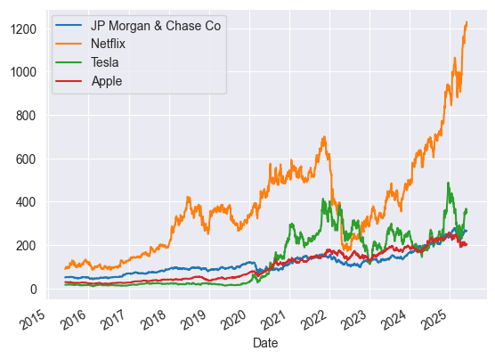
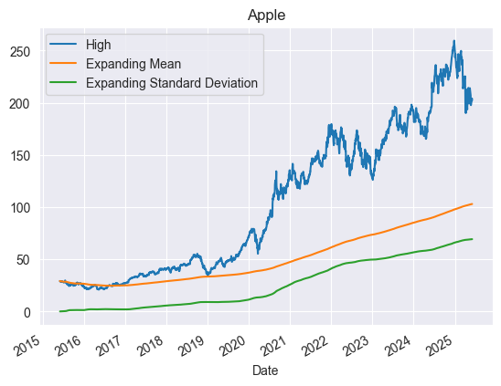
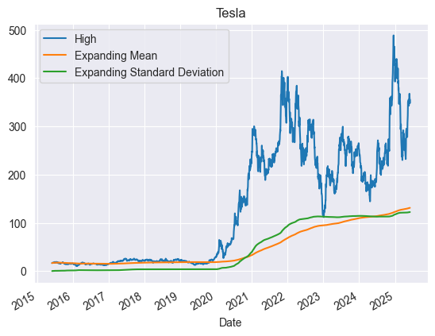
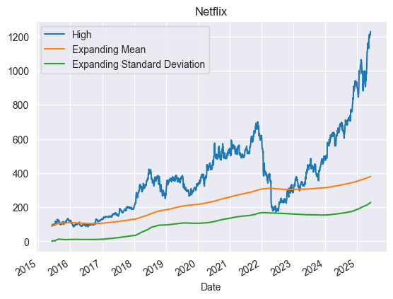
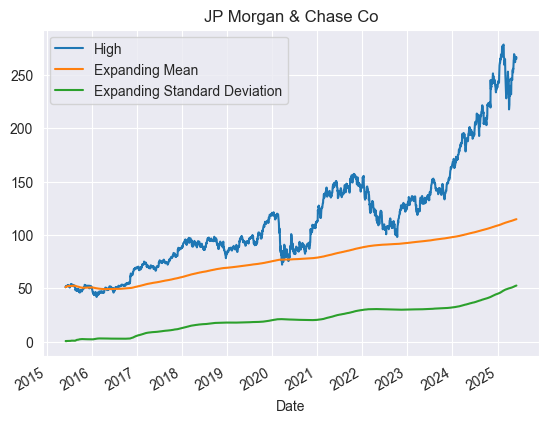
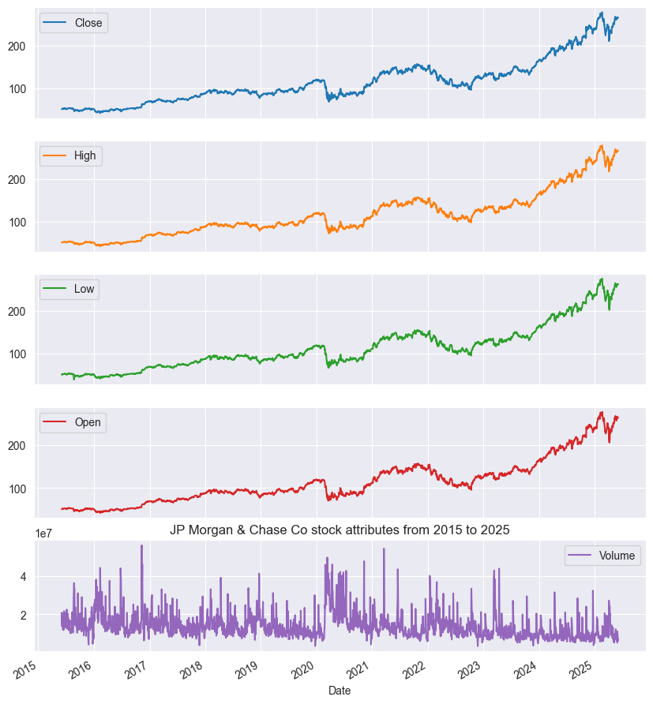
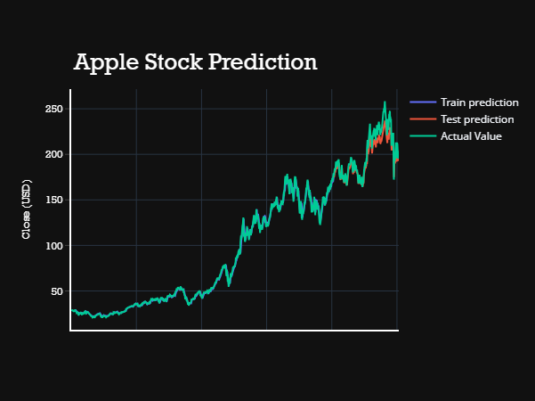
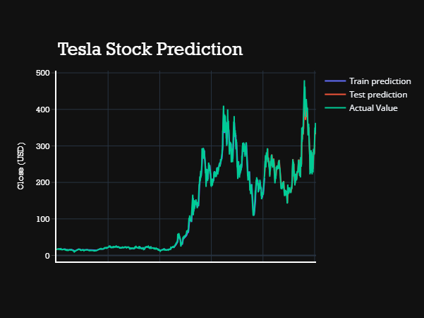
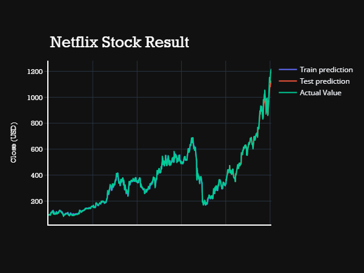
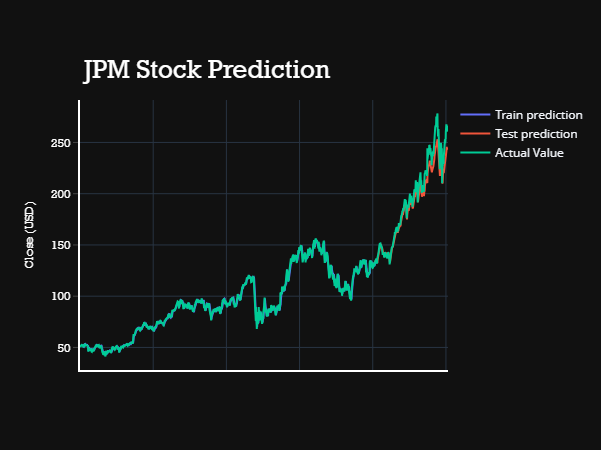

# 📈 Stock Market Forecasting Using Deep Learning

This project forecasts the stock prices of multiple major companies using an LSTM-based deep learning model. By learning from historical trends in each stock individually, the model aims to predict future closing prices and visualize its accuracy.

It includes data collection, visualization, statistical analysis, and time series forecasting with deep learning models (GRU). Interactive plots and clear visualizations are provided to explore trends, compare performance, and evaluate prediction results.

## 📊 Stocks Analyzed

- **JPM** — JPMorgan Chase & Co.  
- **NFLX** — Netflix, Inc.  
- **AAPL** — Apple Inc.  
- **TSLA** — Tesla Inc.
📅 **Date Range:** 4 June 2015 – 4 June 2025  
🛠️ **Interval:** Daily

---

## 🧠 Technologies Used

- **Python 3.x**
- **Jupyter Notebook**
- **Libraries:**
  - `pandas`, `numpy`
  - `matplotlib`, `seaborn`
  - `scikit-learn`
  - `keras` (TensorFlow backend)
  - `yfinance` for data collection

---

## 📥 Data Source

All stock data was collected using the [`yfinance`](https://pypi.org/project/yfinance/) Python library, which retrieves historical market data from Yahoo Finance.

---

## 🏗️ Project Workflow

### 1. Data Collection
- Used `yfinance` to fetch historical stock price data for each ticker individually.

### 2. Preprocessing
- Selected only the 'Close' prices for analysis.
- Normalized values between 0 and 1 using **MinMaxScaler**.
- Created 100-day lookback windows to form time series sequences for LSTM.

### 3. Model Architecture

Each stock was modeled **independently** using the same LSTM architecture.

### 4. Training and Testing
- Trained each model on 80% of its stock’s data.
- Tested on the remaining 20% to evaluate forecasting performance.
- Trained for 100 epochs (modifiable).

### 5. Visualization
- Plotted **actual vs predicted** closing prices for each stock individually.
- Graphs provide visual insight into prediction accuracy.

---

## 🔎Analysis

The LSTM model successfully captured time-based patterns in each stock’s price behavior and produced forecasts that align with historical trends.

### 📈 High Value Trends & Observations

- **Apple (AAPL)** displayed a steadily increasing trajectory in its "High" values over the 10-year period. Especially post-2019, the highs followed a near-linear growth trend with fewer drastic spikes, reflecting its stable market sentiment and strong fundamentals.

  
- **Tesla (TSLA)** showed an exponential rise in its "High" values after 2019, reflecting the surge in investor interest and rapid market expansion. TSLA’s “High” value overtook others after 2020, though with noticeable volatility. This made the model’s prediction more challenging during periods of steep climbs or corrections.

  
- **Netflix (NFLX)** initially tracked similar "High" values as JPM and remained close until around 2012. However, post-2013, NFLX began a consistent upward trend with significant spikes between 2018–2021, coinciding with major subscription growth and global expansion. Thereafter, slight dips were observed.

  
- **JPMorgan Chase (JPM)** maintained a relatively flat and stable "High" value range, with minor peaks around 2018 and again in 2022. Compared to the tech stocks, JPM’s stock behaved more conservatively, leading to higher prediction accuracy for this ticker.

### 🔍 Insights

- The **"High" value comparison** across these companies shows how tech-driven companies (TSLA, NFLX, AAPL) experience more aggressive growth than financial institutions like JPM.
- A **notable competition** in stock highs is visible post-2016, especially between TSLA and AAPL, with TSLA eventually taking the lead.
- **JPM** had periods (like 2009–2013) where the highs remained under the mean for extended durations, indicating **post-crisis recovery** and a **stable market position** rather than aggressive expansion.

### 📉 Error & Limitations

- LSTM captured **long-term trends** effectively but sometimes lagged during **sudden jumps or sharp corrections** — more prominent in TSLA and NFLX.
- Stocks with **smoother and consistent patterns** (like JPM and AAPL) yielded **lower prediction error**.
- Limited feature set (only using 'Close' prices) might have **constrained** the model’s ability to fully interpret market behavior during volatile phases.

## 📊 Predictions

After training the LSTM model on each stock's historical closing prices, we generated predictions for the final 20% of the dataset (i.e., the test set). The model's forecasts aim to closely follow the actual market behavior based on past patterns.

### 🧪 Evaluation

- Predictions were made for the **daily closing prices** of each stock.
- Each model was evaluated visually through line plots comparing actual vs. predicted prices.
- The accuracy was qualitatively assessed by observing how well the model tracked upward/downward trends.

### 📉 Sample Predictions Overview

| Ticker | Performance | Notes |
|--------|-------------|-------|
| **AAPL** | ✅ High accuracy | Smooth trend captured well with minimal lag. |
| **TSLA** | ⚠️ Moderate accuracy | High volatility caused slight underfitting in sharp movements. |
| **NFLX** | ✅ Good trend capture | Some fluctuation during earnings cycles. |
| **JPM**  | ✅ Stable prediction | Lower volatility led to strong fit and minimal error. |

### 📈 Visualization

Each stock’s prediction output is visualized in its own chart:
- **Blue line**: Actual stock closing prices  
- **Orange line**: Predicted stock prices by the LSTM model

---

### 🍏 Apple Inc. (AAPL)

Apple's predictions closely follow its actual prices, reflecting consistent long-term growth. The model handles Apple’s relatively stable pattern with high accuracy.

---

### 🚗 Tesla Inc. (TSLA)

Tesla’s high volatility posed a challenge, but the model still captured general trends well. Slight lags during sharp spikes are visible.

---

### 📺 Netflix Inc. (NFLX)

Netflix's seasonal growth and pullbacks were modeled effectively. The LSTM performed well during stable periods but missed a few sharp dips.

---

### 🏦 JPMorgan Chase & Co. (JPM)

JPM’s conservative price movements were modeled smoothly, with predictions overlapping the actual prices for much of the test range.

---

These visual plots help in:
- Observing how closely the model follows real market trends
- Identifying lag or under/overestimation during sharp movements
- Evaluating generalization on unseen data

## 🔗 Connect with Me

Feel free to reach out or explore more of my work:

- 📇 **LinkedIn**: [Devansh Dhawan](https://www.linkedin.com/in/devanshdhawan/)  
- 📁 **Portfolio / Other Projects**: [GitHub Profile](https://github.com/DevDhawan1)  
- 📬 **Email**: devanshdhawan8943@gmail.com

🎉 **Thanks for reading!**  
Feel free to ⭐ star the repo, share your thoughts, or connect with me on my socials.
